# Consumer Lending Approval Analysis

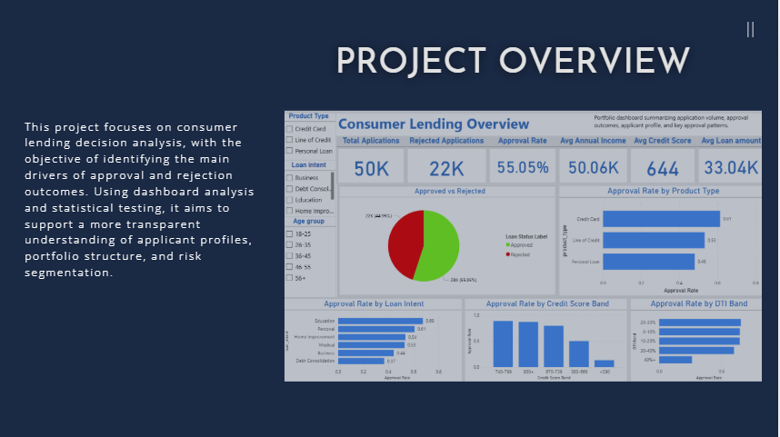

## 1. Project Overview

This project analyzes a consumer lending dataset to understand what drives loan approval and rejection decisions. The work combines three layers of analysis:

- a **Power BI dashboard** to show portfolio patterns and risk signals,
- **statistical validation in JASP** to test whether the observed patterns are significant,
- and a **business interpretation** focused on decision quality, risk concentration, and screening logic.

The objective is not only to describe the data, but to show how a lending team could use analytics to make approval decisions more consistent, transparent, and risk-aware.

---

## 2. Business Context

In consumer lending, approval decisions depend on borrower quality, debt burden, and credit behavior. A weak screening process can create two problems at the same time:

- **good borrowers may be rejected**, which reduces growth,
- **risky borrowers may be approved**, which increases future losses.

This project was designed from the perspective of a lending business that wants to understand:

- which applicant characteristics are linked to approval,
- where rejection risk is concentrated,
- and which borrower segments need closer review.

---

## 3. Project Objectives

The project focuses on five questions:

1. What does the overall lending portfolio look like?
2. Which applicant segments have the highest rejection risk?
3. How do borrower profiles differ between approved and rejected applications?
4. Which observed patterns are statistically significant?
5. What actions could improve screening quality and decision consistency?

---

## 4. Dataset

The analysis uses `Loan_approval_data_2025.csv`.

**Dataset profile**
- 50,000 applications
- 20 variables
- target variable: `loan_status`
- balanced outcome mix: approvals and rejections are both well represented

**Main variable groups**
- borrower profile: age, income, employment years
- credit quality: credit score, credit history years, delinquencies, default history
- debt burden: current debt, debt-to-income ratio, loan-to-income ratio
- lending structure: product type, loan intent, interest rate, loan amount

**Dataset limitations**
- no time dimension
- no post-disbursement repayment outcome
- very clean structure, likely curated or synthetic
- useful for approval analysis, but not a full credit lifecycle study

---

## 5. Tools Used

- **Power BI** - dashboard design and business storytelling
- **JASP** - statistical testing and regression
- **Excel / CSV** - light data preparation
- **GitHub** - project presentation and documentation

---

## 6. Analytical Structure

The project is organized into three dashboard views and one statistical validation layer:

1. **Executive overview** - portfolio size, approval mix, applicant profile
2. **Risk segmentation** - rejection patterns, debt burden, and credit history risk
3. **Applicant profile** - portfolio composition and borrower profile
4. **Statistical validation** - t-tests, chi-square test, and logistic regression

---

## 7. Power BI Dashboard

### 7.1 Executive Overview

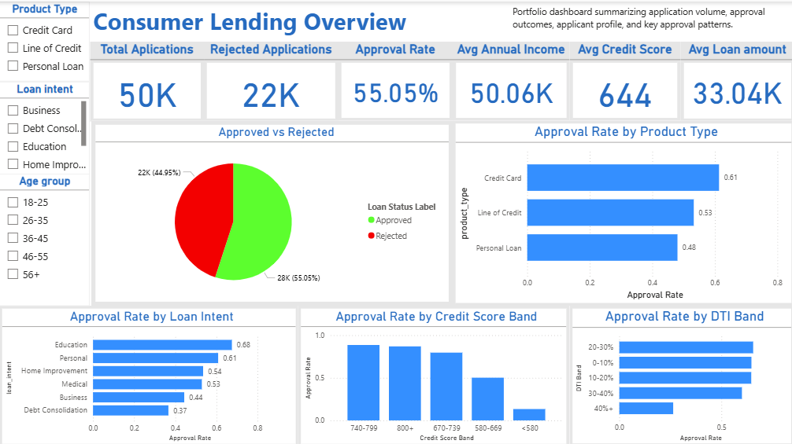

This page provides a high-level view of the lending portfolio. It shows application volume, approval performance, borrower profile, and broad approval trends across product and applicant segments.

**Key insights**
1. The portfolio includes **50K applications** with an **approval rate of 55.05%**. This suggests a moderately selective approval process rather than an extreme risk-off model.
2. Approval rates improve materially as **credit score quality increases**. This is the clearest top-line signal that creditworthiness is central to decision outcomes.
3. Approval outcomes also vary by **product type** and **loan intent**, showing that lending decisions are not driven by borrower quality alone, but also by product context.

**What this means**
The portfolio does not behave randomly. Approval decisions follow visible patterns, and these patterns can be monitored. This is a good starting point for a rule-based review framework.

**Main bottleneck**
The overview shows patterns, but it does not isolate where risk is concentrated. Without deeper segmentation, the business can see variation but cannot yet act on it.

**Recommended action**
Use the overview page as a monitoring layer, then move directly into rejection drivers and risk clustering to support decision rules and review priorities.

---

### 7.2 Risk Segmentation & Rejection Patterns

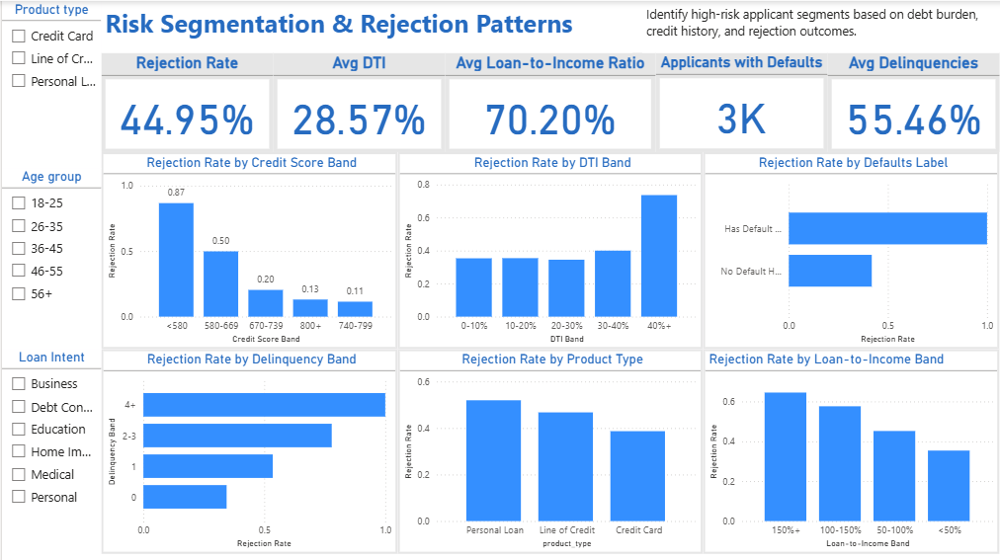

This page focuses on rejection risk. It isolates the borrower characteristics most strongly linked to negative outcomes, especially debt burden and weak credit history.

**Key insights**
1. Rejection rates rise sharply when **loan-to-income ratio** and **debt-to-income ratio** increase. Borrowers with heavier financial burden are materially less likely to be approved.
2. **Default history** is one of the strongest red flags in the dataset. Applicants with prior defaults are heavily concentrated in the rejected group.
3. **Delinquencies in the last two years** also show a clear pattern: more past delinquency is associated with more rejections.
4. Rejection rates differ across **product types**, with some products showing structurally higher screening pressure.

**What this means**
The rejection pattern is not only about low credit score. It is the combination of **debt pressure**, **negative credit history**, and **product context** that drives risk concentration.

**Main bottleneck**
A lending team may look at many variables, but not all variables are equally useful at the screening stage. The core bottleneck is the lack of a clear hierarchy of risk indicators.

**Recommended action**
Prioritize manual review for applications with:
- high debt-to-income ratio,
- high loan-to-income ratio,
- prior defaults,
- repeated delinquencies.

These variables should sit at the center of pre-screening logic.

---

### 7.3 Applicant Profile & Portfolio Insights

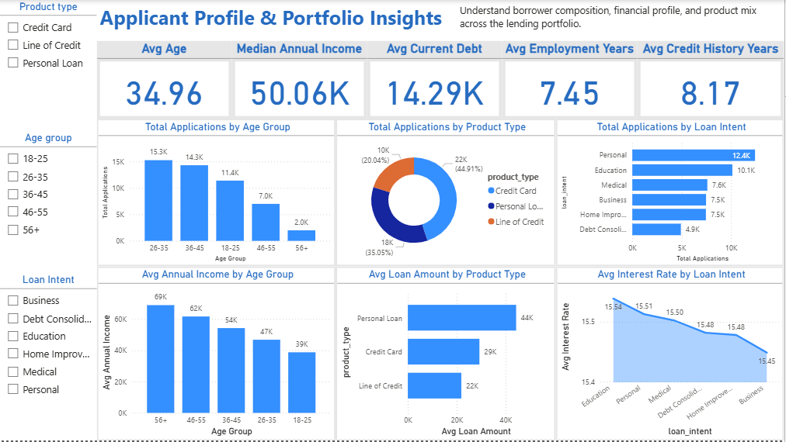

This page describes who the applicants are and how the lending portfolio is structured across age groups, products, and borrowing purposes.

**Key insights**
1. Approved applicants tend to come from stronger borrower profiles: older age groups, higher income levels, longer employment histories, and longer credit histories.
2. The portfolio is not evenly distributed. Some **product types** and **loan intents** account for a larger share of total applications and therefore deserve more operational attention.
3. Average **loan amount**, **income level**, and **interest rate** differ across borrower segments, which means the portfolio carries structural variation, not just case-by-case differences.

**What this means**
Portfolio quality depends not only on who gets approved, but also on where the application flow comes from. Segment mix matters. High-volume segments can create hidden pressure on decision quality if not tracked closely.

**Main bottleneck**
If portfolio composition is ignored, the business may optimize for approval rate while missing concentration risk in certain products or borrower groups.

**Recommended action**
Track borrower mix and product mix alongside approval outcomes. This helps the lending team distinguish between a pricing issue, a segment issue, and a true credit quality issue.

---

## 8. Statistical Validation in JASP

The dashboard shows strong visual patterns. Statistical testing was used to confirm whether these differences are significant and to identify the variables most closely linked to approval decisions.

---

### 8.1 Descriptive Statistics by Loan Status

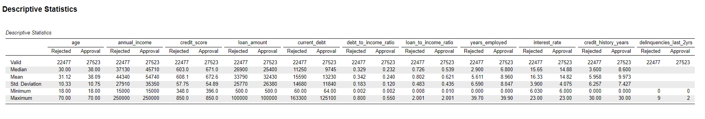

Descriptive statistics show a clear difference between approved and rejected applicants.

**Key insights**
1. Approved applicants are older, earn more, have higher credit scores, longer employment histories, and longer credit histories.
2. Rejected applicants carry higher current debt, higher debt-to-income ratios, higher loan-to-income ratios, and higher interest rates.
3. The difference between both groups is broad, not limited to one single metric.

**What this means**
Approval outcomes are not explained by a narrow rule. The approved group is stronger across multiple dimensions at the same time.

**Main bottleneck**
Looking at one variable at a time can create false confidence. A full applicant profile matters more than one isolated metric.

**Recommended action**
Treat approval as a multi-factor decision. Build screening logic around combined borrower strength and debt burden rather than one-dimensional thresholds.

---

### 8.2 Independent Samples T-Test - Credit Score

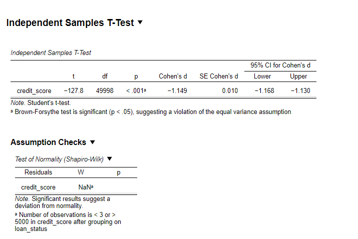
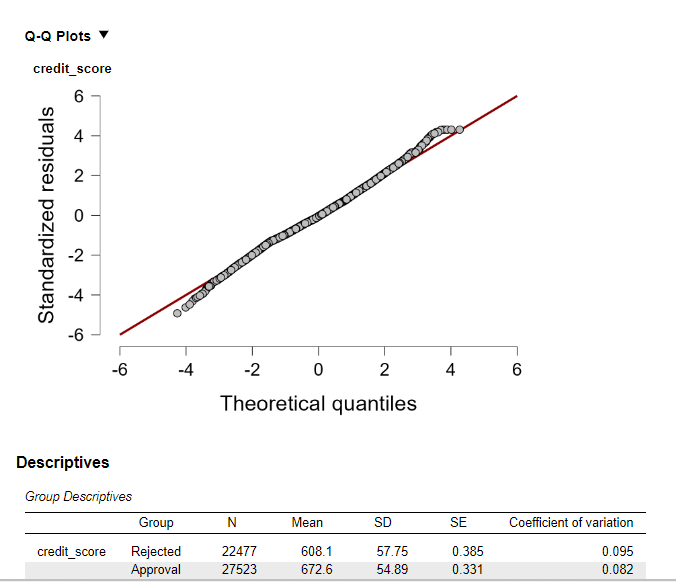

An independent-samples t-test was used to compare credit scores between approved and rejected applicants.

**Result**
- **t = -127.8**
- **p < .001**
- **Cohen's d = -1.149**

**Key insights**
1. Approved applicants have a much higher average credit score than rejected applicants.
2. The result is statistically significant at a very high level.
3. The effect size is large, which means the difference is not only significant, but also practically important.

**What this means**
Credit score is one of the strongest approval drivers in the dataset. This variable is not marginal - it is central.

**Main bottleneck**
If the lending team uses credit score only as a reference metric instead of a primary filter, screening quality may weaken.

**Recommended action**
Use credit score as a core decision variable in both automated screening and manual review prioritization.

---

### 8.3 Independent Samples T-Test - Debt-to-Income Ratio

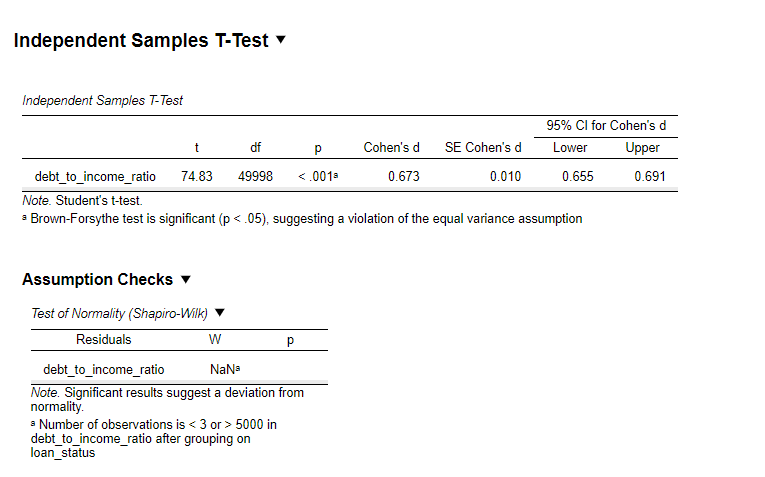
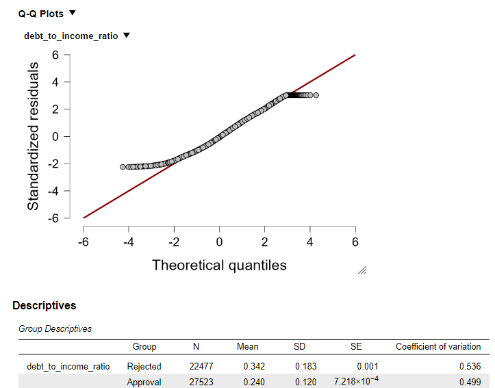

A second t-test compared debt-to-income ratios across approved and rejected applicants.

**Result**
- **t = 74.83**
- **p < .001**
- **Cohen's d = 0.673**

**Key insights**
1. Rejected applicants have materially higher debt-to-income ratios than approved applicants.
2. The result is statistically significant.
3. The effect size is moderate to strong, which confirms that debt pressure is an important decision factor.

**What this means**
Debt burden is not a secondary signal. It is one of the clearest practical constraints in approval decisions.

**Main bottleneck**
Without strong DTI monitoring, the business risks approving applicants whose repayment capacity is already stretched.

**Recommended action**
Set tighter review rules for applications with elevated DTI and combine this check with credit history variables for better risk filtering.

---

### 8.4 Chi-Square Test - Default History vs Loan Status

A chi-square test was conducted to evaluate the relationship between default history and loan outcome.

**Result**
- **Chi-square = 3459**
- **p < .001**
- **Cramer's V = 0.263**

**Key insights**
1. Default history has a strong and statistically significant association with rejection outcomes.
2. Applicants with prior default history are much more concentrated in the rejected segment.
3. This is not a weak background pattern; it is a clear structural signal.

**What this means**
Default history should be treated as a major credit warning indicator.

**Main bottleneck**
If default history is not clearly embedded in screening rules, the approval process may fail to separate structurally weak applicants from borderline but acceptable ones.

**Recommended action**
Use prior default history as a high-priority risk trigger and place these applications into stricter review workflows.

---

### 8.5 Binary Logistic Regression - Approval Drivers

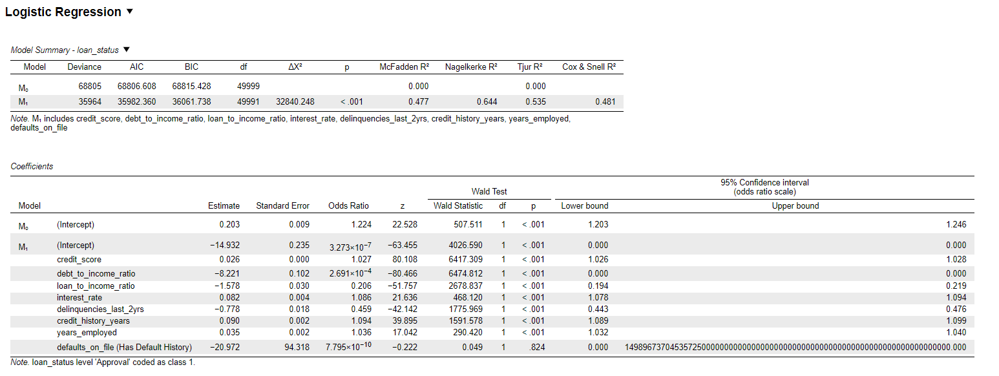
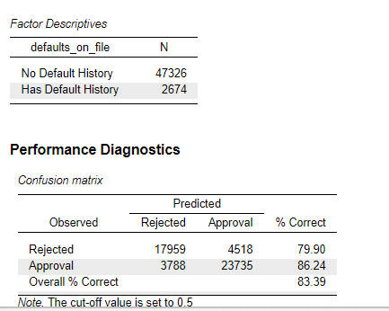

A binary logistic regression model was used to evaluate which variables remain important when considered together.

**Model performance**
- **McFadden R² = 0.477**
- **Nagelkerke R² = 0.644**
- **Overall accuracy = 83.39%**

**Key insights**
1. The model shows strong explanatory power for a baseline approval model.
2. **Credit score** increases approval likelihood, while **debt-to-income ratio**, **loan-to-income ratio**, and **delinquencies** reduce approval likelihood.
3. **Employment years** and **credit history years** improve approval odds, which is consistent with the borrower profile analysis.
4. The `defaults_on_file` variable shows instability in the logistic model because the dataset displays near-complete separation for that category. This variable is therefore better interpreted through the chi-square result rather than the regression coefficient.

**What this means**
Approval decisions are multi-factor. Strong borrower quality improves approval odds, while debt burden and negative credit behavior reduce them sharply.

**Main bottleneck**
A screening model can fail if all variables are treated equally or if unstable variables are interpreted without caution.

**Recommended action**
Use logistic regression as a structured decision support tool, but keep business judgment around high-risk categories where separation or extreme imbalance appears.

---

## 9. Main Findings

Across both dashboard analysis and statistical testing, five conclusions stand out:

1. **Credit quality is the strongest approval driver.**  
   Approved applicants have materially higher credit scores, and the difference is both statistically and practically large.

2. **Debt burden is a major rejection driver.**  
   Both debt-to-income ratio and loan-to-income ratio show a strong negative relationship with approval outcomes.

3. **Default history is a critical warning signal.**  
   The association with rejection is strong enough to justify tighter workflow treatment.

4. **Borrower stability matters.**  
   Longer employment history and longer credit history improve approval odds.

5. **Portfolio composition matters.**  
   Product type and loan intent influence both approval and rejection patterns, so business context must be considered alongside borrower risk.

---

## 10. Business Recommendations

Based on the findings, the following actions would improve decision quality:

### 10.1 Strengthen pre-screening rules
Applications with high DTI, high loan-to-income ratio, prior defaults, or repeated delinquencies should move into stricter review buckets.

### 10.2 Build a tiered review process
Not all applications need the same level of review. A tiered workflow can reduce analyst workload while keeping stronger control over risky segments.

### 10.3 Monitor segment concentration
Approval quality should be reviewed by product type and loan intent, not only at total portfolio level. High-volume segments can hide concentrated risk.

### 10.4 Use statistical monitoring, not dashboard tracking alone
Visual patterns are useful, but major lending signals should be tested regularly to confirm that observed differences remain real and stable.

---

## 11. Limitations

This project has several limitations:

- the dataset has no time variable, so trend analysis is not possible
- no post-loan repayment outcome is available
- the dataset appears highly curated and may not fully reflect real operational noise
- some variables behave too cleanly, which can create separation issues in regression

These limitations do not reduce the value of the analysis, but they do define its scope.

---

## 12. Next Steps

This project can be extended in three directions:

1. build a lightweight machine learning layer to compare baseline logistic regression with tree-based models,
2. add feature importance or explainability analysis,
3. move to a more realistic lending dataset with time dimension and repayment outcomes.

---
